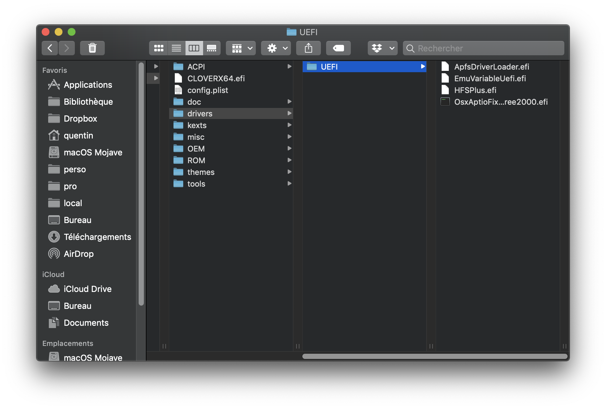
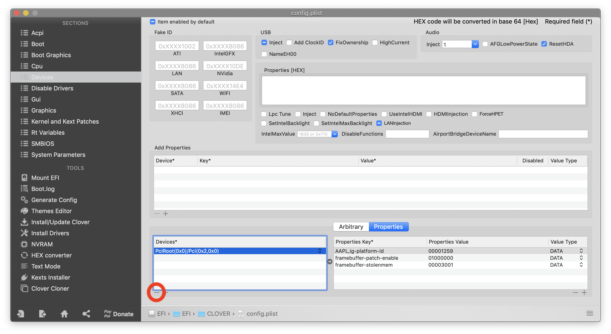

# Comment j'ai monté mon "Hackintosh vanilla" ?

*Article en cours de rédaction...*

*La lecture de cet article requiert une certaine base de connaissance concernant le Hackintosh. Seconde précision, le terme "vanilla" signifie que l'installation du Hackintosh se fait sans aucune modification du système de fichier de macOS (il est donc possible, par exemple, de cloner la partition système pour la faire démarrer sous un vrai Mac ou un autre Hackintosh). Tous les éléments spécifiques au "hack" seront stockés dans la partition de `boot` (la partition `/EFI`).*

## Introduction
Début 2017, j'ai monté mon premier PC, pour jouer. N'étant pas forcément renseigné sur l'existence et la stabilité des Hackintosh à cette époque, cet aspect n'est pas vraiment rentré en ligne de compte lors du choix de mes composants. Néanmoins (par chance probablement), il s'est avéré qu'avec une carte mère série 200, un Intel Core i5 et une GTX 1060, ma configuration "PC" était (sur le papier) compatible macOS. À l'époque, Sierra était la dernière version de macOS et les GPU NVIDIA était encore pris en charge avec les web drivers NVIDIA. Tout ceci étant dit, l'[installation de macOS Sierra](https://www.tonymacx86.com/threads/in-progress-macos-sierra-i5-7600-msi-z270-msi-geforce-1060-3go.222057/) s'est faite sans trop de difficultés en 2017. Comme vous pourrez le lire sur le forum de tonymacx86 quelques détails ne fonctionnaient pas. Cependant, à l'époque j'avais un Mac Book Pro pour bosser au quotidien et le Hackintosh était plus un "défi" qu'une nécessité donc la partition est resté un moment sans être utilisée et je n'ai pas pris le temps de fixer les problèmes rencontrés.
Ayant changé de travail courant 2019, cela fait un moment que je ne travaille plus sous macOS (et cela ma manque !), rassurez-vous, j'ai dual-booté sous Ubuntu le premier ordinateur Windows que l'on m'a donné. Bref, en clair, j'ai sous le coude :
- Un Mac Book Pro 15" de 2018 que je n'utilise presque plus
- Un PC Windows (juste pour les jeux, promis) monté par mes soins avec un setup sympa : triple screen dont un en 144Hz.

Donc depuis septembre 2019 je me suis mis en tête de transformer ma tour actuelle en un dual-boot propre & fonctionnel Windows / macOS afin de gagner en confort en mode "bureau" à la maison, mais aussi afin de pouvoir me séparer de mon Mac Book Pro qui me sert peu (probablement au profit d'un Mac Book Air, plus portable).
Nous voilà donc rendu ici ! Deux dernières précisions :
- J'ai actuellement une GTX 1060 de NVIDIA dans ma tour, ce qui n'est pas compatible avec macOS Mojave (je ne veux pas retourner sous High Sierra car cette solution n'est pas pérenne). J'ai donc bien fouillé sur le net et j'ai commandé une RX 550 de Radeon qui devrait fonctionner sous macOS Mojave. Je vous tiens au courant. Attention néanmoins, si vous souhaitez faire la même chose, renseignez-vous très bien car seules quelques versions de la RX 550 fonctionnent (sont censées fonctionner) sous Polaris 11 (version Baffin) ce qui est totalement différent que la version plus répandue Polaris 12 (Lexa). Je vous tiens au courant à ce sujet.
- Enfin, en ce qui concerne la connectivité, j'avais jusqu'à présent fait le choix de me contenter d'ethernet. Seulement, pour pérenniser un Hackintosh, la continuité Apple est clairement un must have. Une carte Wifi / Bluetooth PCIe est donc en route !

## Hardware
- Carte mère : MSI Z270 Gaming Pro Carbon
- CPU : Intel Core i5-7600
- GPU : actuellement Intel HD 630 (mais j'espère passer sous RX 550 bientôt)
- RAM : 2 x 8Go DDR4 2400MHz Ballistik LT Sport
- Wifi / Bluetooth : carte PCIe Fenvi FV-HB1200 (AliExpress)
- Disques :
	- Samsung 970 EVO Plus 500GB
	- Crucial MX300 750GB
	-  Divers HDD

Détails:
- Ventilateur : Be Quiet! Pure Rock
- Alimentation : Lepa N550-MA MXF1 (550W)
- Boîtier : BitFenix Nova
- Une carte MSI GeForce GTX 1060 3GB (inutilisable depuis Mojave), utilisée sous mon boot Windows

## Pré-requis
- [Clover](https://github.com/Dids/clover-builder/releases) : pour installer le boot loader dans la partition EFI (USB puis Hard Disk)
- [Clover Configurator](https://mackie100projects.altervista.org/download-clover-configurator/) : pour modifier plus facilement le fichier de configuration `config.plist` de Clover.
- [macOS Mojave](https://itunes.apple.com/fr/app/macos-mojave/id1398502828?ls=1&mt=12&l=fr) téléchargé depuis l'App Store (vous aurez donc besoin d'un Mac ou d'un Hackintosh)
- Un clé USB de 8GB minimum

## Installation
*Même si j'ai glané beaucoup d'information sur le site tonymacx86, je n'utilise plus la suite UniBeast / MulitBeast / KextBeast pour installer un Hackintosh. Ces outils sont de bons outils mais il est - selon moi - compliqué de bien comprendre ce que l'on fait et d'aboutir à une installation propre et optimisé.*

L'installation est assez simple, je vais vous donner ici les différentes étapes à suivre, mais pour avoir les détails, je vous inviterai à vous référer à [ce guide](https://hackintosh.gitbook.io/-r-hackintosh-vanilla-desktop-guide/).

### Préparer et créer la clé USB d'installation

#### Créer le media d'installation de macOS Mojave
1. Insérez votre clé USB, lancez l'application terminal et taper la commande `diskutil list`. Vous devriez obtenir un résultat similaire à celui-ci :


3. Identifiez votre clé USB (réparable grâce à sa capacité) soyez très prudent car nous allons effacer la clé. Dans mon cas, il s'agit du `/dev/disk3`.
4. Effacez la clé et la formattez la en HFS+ à l'aide de la commande suivante :
`diskutil eraseDisk`


Si vous exécutez à nouveau la commande `diskutil list` vous devriez être en mesure d'identifier votre clé fraîchement formatée.


5. Créez un media d'installation de macOS. Une fois que vous avez téléchargé macOS Mojave depuis l'App Store, il vous suffit de suivre [les instructions officielles d'Apple](https://support.apple.com/fr-fr/HT201372). La procédure est relativement longue et les retours sur le terminal sont concis, soyez patient et ne quittez pas le terminal avant d'avoir récupérer la main.

```
sudo /Applications/Install\ macOS\ Mojave.app/Contents/Resources/createinstallmedia --volume /Volumes/Hackintosh\ Mojave
```


À ce stade, vous devriez voir sur votre bureau un volume nommé "Install macOS Mojave". Si oui, c'est parfait !

#### Installation du boot loader (Clover)

1. Exécuter le package `Clover_vX.pkg`. Spécifiez bien votre clé USB comme emplacement d'installation lors de l'étape "Destination". **Attention à ne pas installer Clover sur le disque principal de votre Mac actuel.** 


Pour une configuration identique à la mienne (MSI série 200), lors de l'étape "Type d'installation", cliquez sur "Personnaliser", vous allez avoir besoin de sélectionner les drivers suivants (et seulement ceux-là) avant de finaliser l'installation  :
	- HFSPlus
	- ApfsDriverLoader
	- EmuVariableUefi


Finaliser l'installation. Si tout s'est bien passé vous devriez voir apparaître sur votre bureau un Volume `EFI`.

2. Une particularité de cette carte mère fait que vous allez devoir également télécharger [ce driver](https://github.com/koush/EFI-X99/blob/master/CLOVER/drivers64UEFI/OsxAptioFix2Drv-free2000.efi) et le mettre manuellement dans la partition `EFI` de votre clé USB sous `/EFI/CLOVER/drivers/UEFI`. Si vous ne le faites pas, vous aurez aléatoirement des crashs au démarrage dus à des problèmes de mémoire.



3. Téléchargez la liste d'extensions de kernel (kext) suivantes depuis [le guide ](https://hackintosh.gitbook.io/-r-hackintosh-vanilla-desktop-guide/gathering-kexts) et placez les dans votre partition EFI (sous `/EFI/CLOVER/kexts/Other`) :
	- AppleALC.kext
	- IntelMausiEthernet.kext
	- Lilu.kext
	- USBInjectAll.kext
	- VirtualSMC.kext
	- WhateverGreen.kext

Je rappelle que j'utilise actuellement la puce GPU intégrée sur les processeurs Intel (iGPU), cette liste d'extensions kernel évoluera (peut-être) lors de l'ajout de la connectivité (Wifi / Bluetooth) et de la carte graphique Radeon RX 550.


#### Configuration du boot loader
Nous venons de finir l'installation du boot loader, il ne nous reste plus qu'à configurer quelques détails. Si vous voulez bien comprendre toutes les étapes de cette configuration, je vous invite à utiliser [le guide](https://hackintosh.gitbook.io/-r-hackintosh-vanilla-desktop-guide/config.plist-basics) puis à parcourir la section adaptée à votre génération de processeur et à télécharger le fichier `config.plist` correspondant.

En ce qui me concerne, j'ai pris le fichier [`config.plist`](https://github.com/corpnewt/Hackintosh-Guide/blob/master/Configs/KabyLake/config.plist) correspondant à la génération Kaby Lake et j'ai simplement fais les 2 modifications suivantes :
- Retiré les `Properties` définies dans la section `Devices`. Cela donnait une teinte rose à mes écrans lors du boot et du run de macOS



- Retiré les patches qui sont antérieurs à la version 10.14 de macOS dans la section `Kernel and Kext Patches`


Si vous voulez aller droit au but, voici mon fichier [config.plist](config.plist).

Une fois que vous aller téléchargé (et éventuellement modifié) le fichier, il vous suffit de remplacer le fichier `config.plist` présent sur le Volume `EFI` dans `/EFI/CLOVER/config.plist`.


Votre clé d'installation est prête et le plus dur est derrière vous !

### Paramétrage du BIOS
Pour que macOS puisse s'installer sur un ordinateur qui n'est pas un Mac, il y a quelques modifications à effectuer dans le BIOS. Pour vous rendre dans le BIOS, démarrer votre ordinateur et appuyer sur `Del` / `Suppr` dès que l'écran de démarrage apparaît.
1. Choisissez  `Load Optimized Defaults` en pressant F6 puis `Yes`
2. Modifiez ensuite les réglages suivants en utilisant la barre de recherche en haut à droite :
	- XHCI Hand-off : [**Enabled**]
	- Initiate Graphic Adapter : [**IGD**] (vous permet d'utiliser l'iGPU en sortie video de boot)
	- Windows 8.1/10 WHQL Support : [**Enabled**]
	- Windows 7 Installation : [**Disabled**]
	- Boot mode select : [**UEFI**]
	- Extreme Memory Profile (X.M.P) : [**Enabled**]
	- CFG Lock : [**Disabled**]
3. Sauvegardez et quittez le BIOS

### Installer macOS
1. Brancher votre clé USB sur l'ordinateur
2. Démarrer puis pressez F11 dans la phase de démarrage de l'ordinateur pour pouvoir choisir le disque de démarrage.
3. Choisissez votre clé USB, vous devriez arriver sur Clover, le boot manager précédemment installé.
4. Choisissez l'image d'installation de macOS Mojave
5. Réaliser l'installation comme vous l'auriez faite pour un Mac normal
6. Laissez l'ordinateur redémarrer, ne retirez pas la clé USB puis pressez F11 à nouveau pendant la phase de démarrage.

### Démarrer sur votre nouvelle installation
1. Si vous n'avez pas oublié de presser F11, vous devriez vous retrouver devant les mêmes possibilités de boot que précédemment. Choisissez à nouveau votre clé USB pour démarrer. À ce stade, le disque macOS sur lequel nous avons effectué l'installation n'est pas encore bootable.
2. Vous devriez vous retrouver à nouveau sur Clover et devriez voir un nouveau disque pour permettant de finaliser l'installation de macOS, sélectionnez le.
3. Laissez l'installation de macOS se finaliser, à nouveau l'ordinateur rédémarrera, pressez F11, choisissez la clé USB puis démarrer enfin sur votre nouvelle installation de macOS !
4. Configurer comme vous le souhaitez puis nous nous retrouvons sur votre bureau macOS pour la prochain étape

### Rendre votre nouvelle installation macOS bootable sans clé USB
Étape très simple.
1. Utilisez Clover Configurator pour monter les deux partitions `EFI` (celle de votre clé USB et celle de votre disque macOS) puis copiez l'intégralité du dossier `/EFI` de la clé vers le disque.
2. Éjectez la clé, retirez la, redémarrer l'ordinateur
3. Pressez F11 au démarrage et vous devriez, cette fois-ci, pouvoir sélectionner le disque sur lequel vous avez installer macOS en temps que disque de démarrage.
4. Vous devriez vous retrouvez ensuite dans Clover, sélectionner votre disque macOS comme vous l'avez fait précédemment.

C'est fini !

## Si je devais monter un Hackintosh aujourd'hui

- Une i5 ou i7 de 8ème génération
- Une carte mère série 300 mais cette fois-ci, **j'éviterais MSI**. J'ai vu pas mal de témoignages sur les forums, les cartes MSI sont souvent un peu plus "tricky" à faire fonctionner sous Hackintosh. Je me tournerai donc plutôt vers une carte Asus ou Gigabyte.
- Une RX 560 / 570 / 580 / 590 en fonction du besoin
- 16GB de RAM, plutôt de chez G.Skill, les témoignages que je lis sur les forums sont excellents
- Un disque SSD NVMe de 500GB pour le système
- Un disque SSD SATA de 1To pour le stockage (si besoin)
- Pour le reste : une bonne alimentation (attention les cartes Radeon consomment un peu plus que NVIDIA), un bon ventilateur pour le CPU.

## Source et infos diverses

- Le [guide de référence](https://hackintosh.gitbook.io/-r-hackintosh-vanilla-desktop-guide/) pour ceux qui s'intéressent au Hackintosh et veulent des infos fiables et à jour
- Pour ceux qui veulent de l'aide, échanger ou faire des retours d'expérience :
	- https://www.insanelymac.com
	- http://tonymacx86.com/
	- https://hackintosher.com
<!--stackedit_data:
eyJoaXN0b3J5IjpbMTM3Njk4NDc3MCwtOTYzOTY4NDg1LDIwMz
I2MzE4NDAsNjQ5OTg4MTc2LC0xNDA2NTY3MTc2LDQ5MzkzNDg0
NywtMTkzOTUyMTc4NSwxOTkzNDI0ODQ5LDExNzczOTQ1MzddfQ
==
-->