# Mon build Hackintosh "vanilla"

*Article en cours de rédaction...*

*La lecture de cet article requiert une certaine base de connaissance concernant le Hackintosh. Pour information, le terme "vanilla" signifie que l'installation du Hackintosh se fait sans aucune modification du système de fichier de macOS (il est donc possible, par exemple, de cloner la partition système pour la faire démarrer sur un vrai Mac ou un autre Hackintosh). Tous les éléments spécifiques au "hack" seront stockés dans la partition de boot (la partition `EFI`).*

## Introduction
Début 2017, j'ai monté pour la première fois un PC, pour jouer. N'étant pas forcément bien au fait sur l'existence et la stabilité des Hackintosh à cette époque, cet aspect n'est pas vraiment rentré en ligne de compte lors du choix de mes composants. Néanmoins (par chance probablement), il s'est avéré qu'avec les composants choisis (une carte mère série 200, un Intel Core i5 et une GTX 1060), ma configuration "PC" était (sur le papier) compatible macOS. À l'époque, Sierra était la dernière version de macOS et les GPUs NVIDIA étaient encore pris en charge avec les web drivers NVIDIA. Tout ceci étant dit, l'[installation de macOS Sierra](https://www.tonymacx86.com/threads/in-progress-macos-sierra-i5-7600-msi-z270-msi-geforce-1060-3go.222057/) s'est faite sans trop de difficultés en 2017. Comme vous pourrez le lire sur le forum de tonymacx86 quelques détails ne fonctionnaient pas. Cependant, j'avais à l'époque un Mac Book Pro pour bosser au quotidien et le Hackintosh était plus un "défi" qu'une nécessité donc la partition est restée un moment sans être utilisée et je n'ai pas pris le temps de fixer les problèmes rencontrés, de faire les mises à jour & co. Ayant changé de travail courant 2019, je ne travaille plus sous macOS mais sur Ubuntu. J'utilise donc peu mon Mac Book Pro 15" et cela me fait de la peine de voir un ordinateur si "cher" être si peu utilisé. En clair, j'ai sous le coude :
- Un Mac Book Pro 15" de 2018 que je n'utilise presque plus (et dont je pourrais peut-être me passer si j'avais un Hackintosh)
- Un bon setup "PC" sous Windows (juste pour les jeux, promis) : triple screen 24" (dont un en 144Hz), clavier, souris, casque.

Depuis septembre 2019 je me suis donc mis en tête de transformer ma tour actuelle en un dual-boot propre & fonctionnel Windows / macOS afin de gagner en confort en mode "desktop" à la maison, mais aussi afin de pouvoir me séparer de mon Mac Book Pro qui me sert peu (probablement au profit d'un Mac Book Air, plus portable).

## Hardware

- Carte mère : MSI **Z270** Gaming Pro Carbon
- CPU : Intel Core **i5-7600**
- GPU : Asus AREZ **RX 550 2GB**
- RAM : **2 x 8GB DDR4 2400MHz** Ballistik LT Sport
- Wifi / Bluetooth : carte PCIe **Fenvi FV-HB1200** (AliExpress)
- Disques :
	- Samsung **970 EVO Plus 500GB** (NVMe en M.2) - **macOS Mojave**
	- Crucial MX300 750GB (SSD en SATA) - **Windows 10**
	- Samsung 750GB (HDD en USB 3.0) - **500GB pour Time Machine**, le reste pour du stockage

Détails:
- Ventilateur : Be Quiet! Pure Rock
- Alimentation : Lepa N550-MA MXF1 (550W)
- Boîtier : BitFenix Nova
- Un GPU **GeForce GTX 1060 3GB** de chez MSI (inutilisable depuis Mojave), utilisé sous mon boot Windows

## Pré-requis
- [Clover](https://github.com/Dids/clover-builder/releases) : pour installer le boot loader dans la partition EFI de notre clé USB
- [Clover Configurator](https://mackie100projects.altervista.org/download-clover-configurator/) : pour modifier plus facilement le fichier de configuration `config.plist` de Clover.
- [macOS Mojave](https://itunes.apple.com/fr/app/macos-mojave/id1398502828?ls=1&mt=12&l=fr) téléchargé depuis l'App Store (vous aurez donc besoin d'un Mac ou d'un Hackintosh)
- Un clé USB de 8GB minimum

## Installation
*Même si j'ai glané beaucoup d'information sur le site [tonymacx86](http://tonymacx86.com), je n'utilise plus la suite UniBeast / MulitBeast / KextBeast pour installer un Hackintosh. Il est - selon moi - compliqué de bien comprendre ce que l'on fait et d'aboutir à une installation propre et optimisée en utilisant les outils \*Beast.*

L'installation est relativement simple - *une fois que vous avez passé un paquet d'heure à potasser sur le sujet du Hackintosh*. Je vais détailler ici les différentes étapes à suivre, le fil conducteur est très largement inspiré de [ce guide](https://hackintosh.gitbook.io/-r-hackintosh-vanilla-desktop-guide/). Ce même guide est considéré comme **la** référence pour la communauté Hackintosh présente sur [reddit (/r/hackintosh)](https://www.reddit.com/r/hackintosh/) et est un pré-requis si vous comptez demander de l'aider sur le [Discord](https://discord.gg/u8V7N5C) dédié.

### Préparer et créer la clé USB d'installation

#### Créer le media d'installation de macOS Mojave
1. Insérez votre clé USB, lancez le terminal et tapez la commande `diskutil list`. Vous devriez obtenir un résultat similaire à celui-ci :

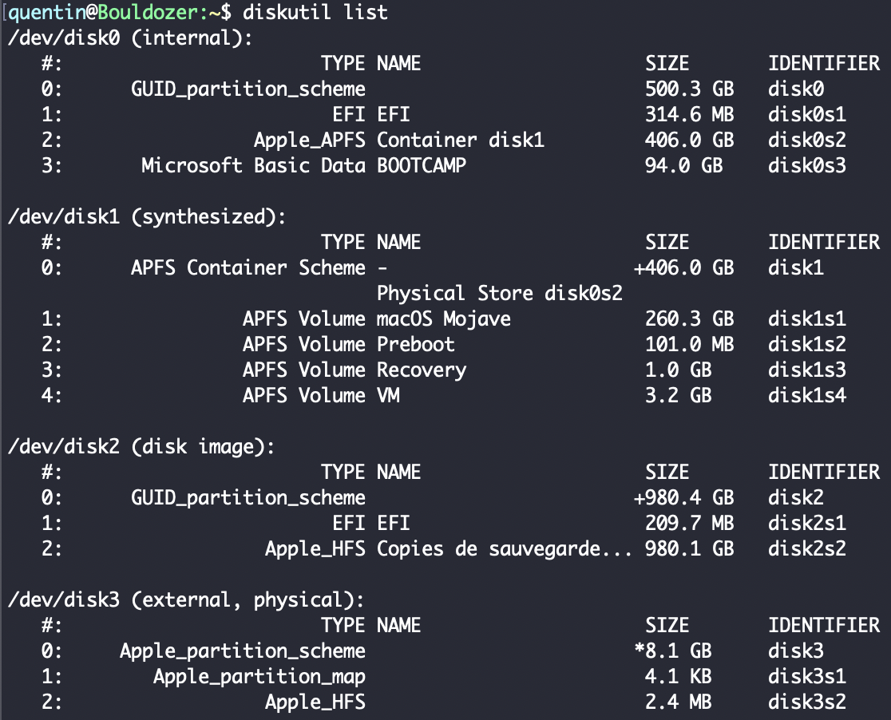

3. Identifiez votre clé USB (réparable notamment grâce à sa capacité) soyez très prudent car nous allons effacer la clé. Dans mon cas, il s'agit du `/dev/disk3`.
4. Effacez la clé et la formattez la en HFS+ à l'aide de la commande suivante (pensez à remplace le `/dev/diskX` par celui qui convient) :
```
diskutil eraseDisk HFS+ "Hackintosh Mojave" /dev/diskX
```

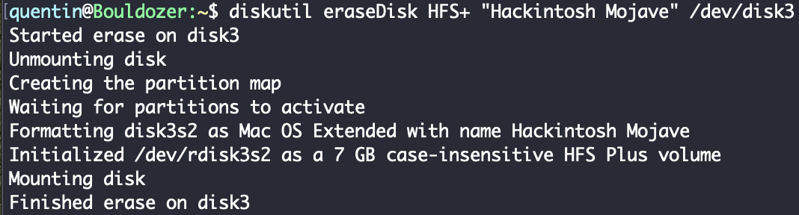

Si vous exécutez à nouveau la commande `diskutil list` vous devriez être en mesure d'identifier votre clé fraîchement formatée.

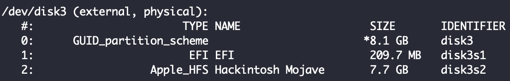

5. Créez un media d'installation de macOS. Une fois que vous avez téléchargé macOS Mojave depuis l'App Store, il vous suffit de suivre [les instructions officielles d'Apple](https://support.apple.com/fr-fr/HT201372). La procédure est relativement longue et les retours sur le terminal sont concis, soyez patient et ne quittez pas le terminal avant d'avoir récupérer la main.

```
sudo /Applications/Install\ macOS\ Mojave.app/Contents/Resources/createinstallmedia --volume /Volumes/Hackintosh\ Mojave
```

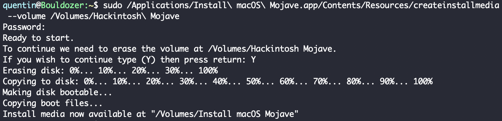

À ce stade, vous devriez voir sur votre bureau un volume nommé "Install macOS Mojave". Si oui, c'est parfait !

#### Installation du boot loader (Clover)

1. Exécuter le package `Clover_vX.pkg`. Spécifiez bien votre clé USB comme emplacement d'installation lors de l'étape `Destination`. **Attention à ne pas installer Clover sur le disque principal de votre Mac actuel.** 

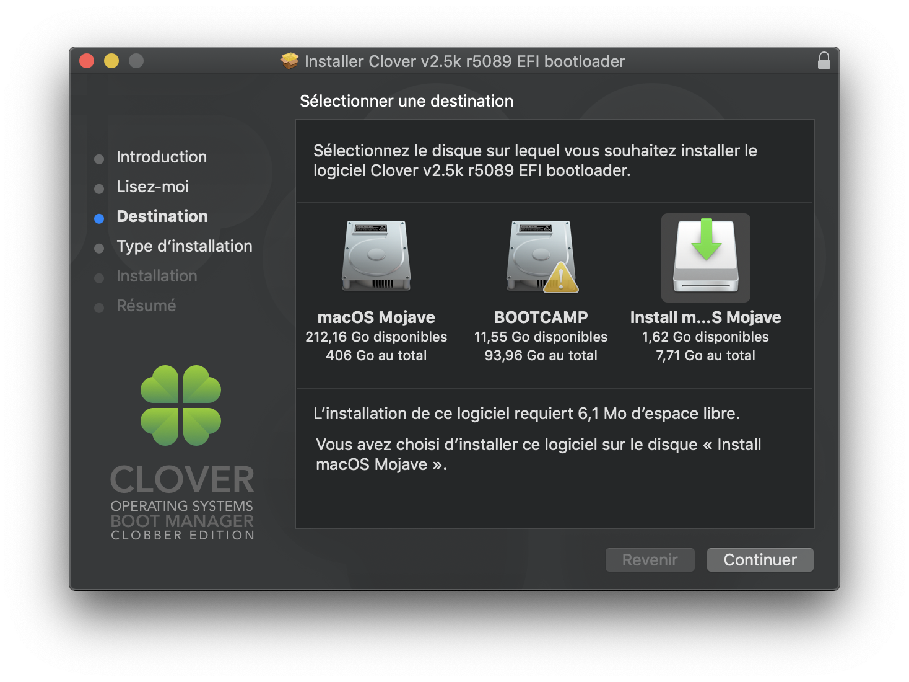

Lors de l'étape `Type d'installation`, cliquez sur `Personnaliser`. Pour une configuration proche ou identique à la mienne (carte mère série 200) vous allez avoir besoin de sélectionner les drivers suivants (et seulement ceux-là) avant de finaliser l'installation  :

- VBoxHfs
- ApfsDriverLoader
- AptioMemoryFix

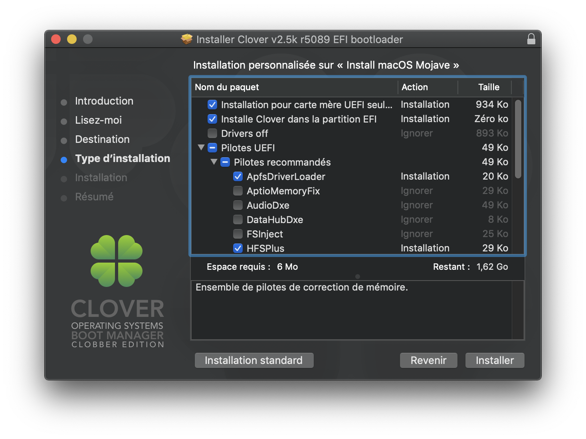

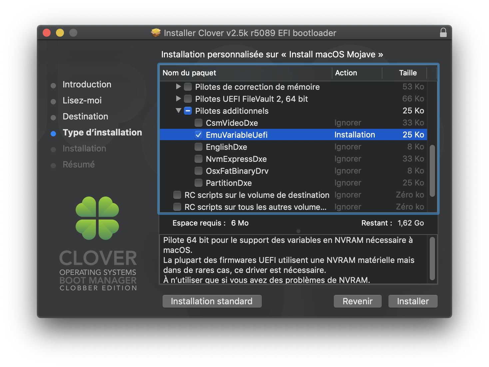

Finalisez l'installation. Si tout s'est bien passé vous devriez voir apparaître sur votre bureau un Volume `EFI`.

3. Téléchargez ensuite la liste d'extensions de kernel (kext) suivante depuis [le guide](https://hackintosh.gitbook.io/-r-hackintosh-vanilla-desktop-guide/gathering-kexts) et placez les dans votre partition EFI (sous `/EFI/CLOVER/kexts/Other`) :
	- AppleALC.kext
	- IntelMausiEthernet.kext
	- Lilu.kext
	- USBInjectAll.kext
	- VirtualSMC.kext
    - WhateverGreen.kext

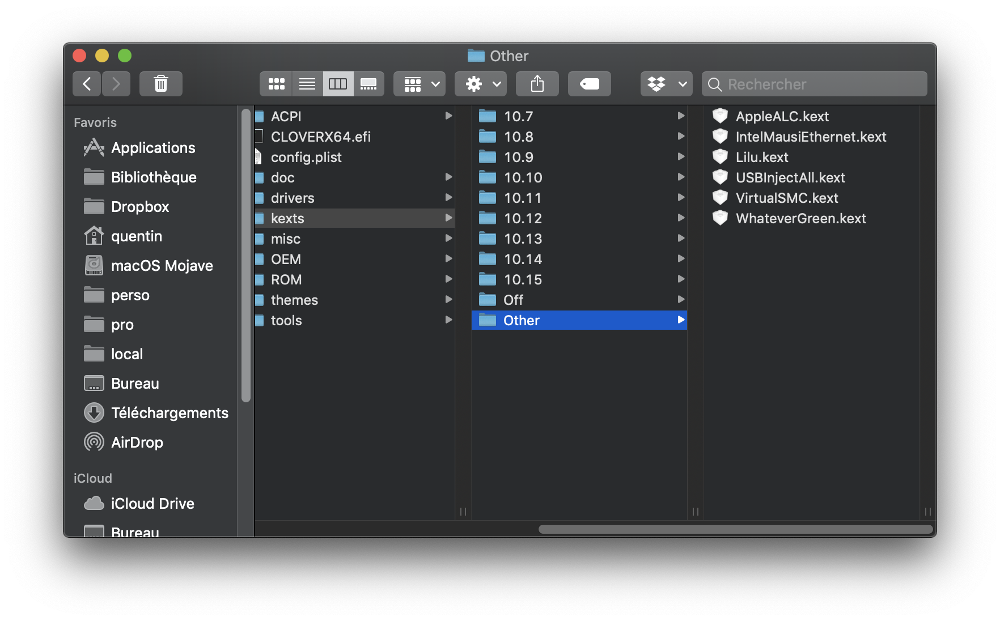

#### Configuration du boot loader
Nous venons de finir l'installation du boot loader, il ne nous reste plus qu'à configurer quelques détails. Si vous voulez bien comprendre toutes les étapes de cette configuration, je vous invite à utiliser [le guide](https://hackintosh.gitbook.io/-r-hackintosh-vanilla-desktop-guide/config.plist-basics) et à parcourir la section adaptée à votre génération de processeur. Vous y trouverez en bas de page le fichier `config.plist` correspondant vous pourrez ensuite le modifier.

En ce qui me concerne, j'ai pris le fichier [`config.plist`](https://github.com/corpnewt/Hackintosh-Guide/blob/master/Configs/KabyLake/config.plist) correspondant à la génération Kaby Lake et j'ai simplement fait les modifications suivantes (en utilisant Clover Configurator pour modifier le fichier) :

- Retirer les patches qui sont antérieurs à la version 10.14 de macOS dans la section `Kernel and Kext Patches`

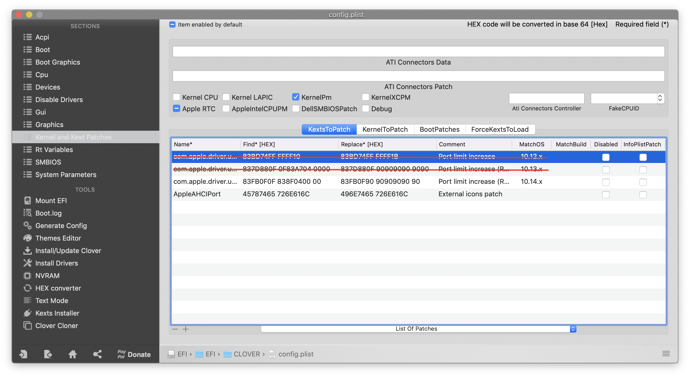

- Dans la partie `Graphics`. Si vous souhaitez utiliser l'iGPU de votre processeur pour l'affichage vous pouvez cocher la case `Inject Intel` par sécurité (normalement Clover fait l'injection par défaut s'il détecte un iGPU intel). En revanche, si vous avez un GPU dédié, prenez soin de **cocher puis de décocher** `Inject Intel` cela permettra d'empêcher explicitement l'injection Intel et c'est important (voire indispensable)

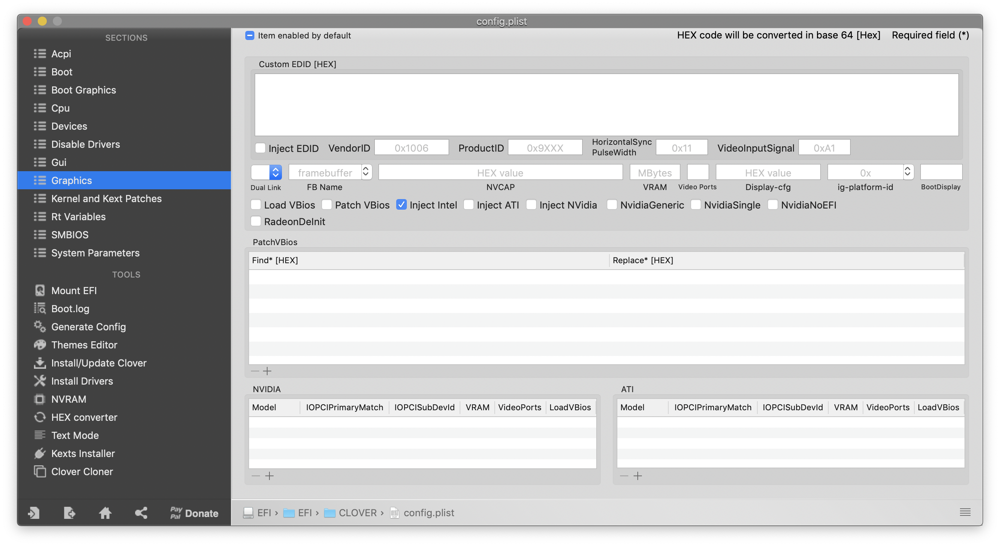

N'oubliez pas de sauvegarder le fichier (`cmd + S`) avant de quitter Clover Configurator.

Une fois que vous avez téléchargé (et éventuellement modifié) le fichier, il vous suffit de remplacer le fichier `config.plist` présent sur le Volume `EFI` dans `/EFI/CLOVER/config.plist`.

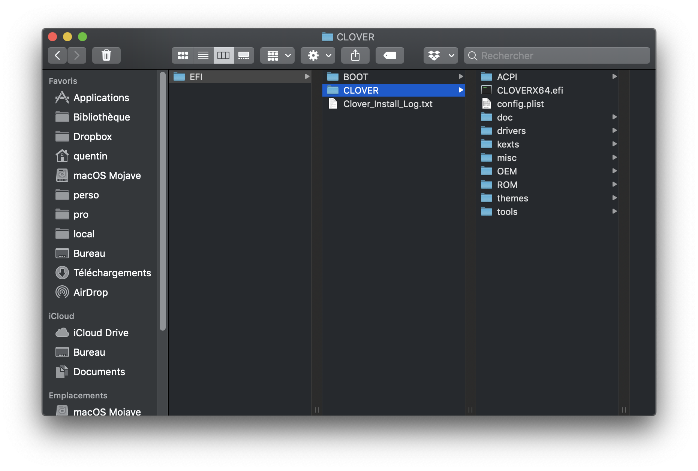

Votre clé d'installation est prête et le plus dur est derrière vous !

### Paramétrage du BIOS
Pour que macOS puisse s'installer sur un ordinateur qui n'est pas un Mac, il y a quelques modifications à effectuer dans le BIOS. Pour vous rendre dans le BIOS, démarrer votre ordinateur et appuyer sur `Del` / `Suppr` dès que l'écran de démarrage apparaît.
1. Choisissez  `Load Optimized Defaults` en pressant F6 (chez MSI) puis `Yes`
2. Modifiez ensuite les réglages suivants en utilisant la barre de recherche en haut à droite pour les trouver :
	- XHCI Hand-off : [**Enabled**]
	- Windows 8.1/10 WHQL Support : [**Enabled**]
	- Windows 7 Installation : [**Disabled**]
	- Boot mode select : [**UEFI**]
	- Extreme Memory Profile (X.M.P) : [**Enabled**]
	- CFG Lock : [**Disabled**]
	- Concernant la partie graphique, deux cas se présentent à nous et je les ai tous les deux essayés :
		- Vous n'avez pas de carte graphique et vous utilisez donc l'iGPU : 
			- Initiate Graphic Adapter : [**IGD**]
		- Vous avez une carte graphique :
		    - Initiate Graphic Adapter : [**PEG**]
		    - IGD Multi-Monitor : [**Enabled**]		
		    - Integrated Graphics Share Memory : [**64M**]
3. Sauvegardez et quittez le BIOS

### Installer macOS
1. Branchez votre clé USB sur l'ordinateur
2. Démarrez puis pressez F11 dans la phase de démarrage de l'ordinateur pour pouvoir choisir le disque de démarrage.
3. Choisissez votre clé USB, vous devriez arriver sur Clover, le boot manager précédemment installé.
4. Choisissez l'image d'installation de macOS Mojave, le nom de l'option devrait ressembler à : **`Boot macOS Install from Install MacOS Mojave`**
5. Réalisez l'installation comme vous l'auriez faite pour un Mac normal.
	- Il est possible qu'il vous faille formater le disque sur lequel vous allez installer macOS afin de pouvoir le "voir" dans la liste de choix des disques d'installation. Pour cela :
		1. Cliquez sur "Utilitaire de disque"
		2. Choisissez votre disque
		3. Effacez-le en choisissant le format APFS (qui est le nouveau système de fichier d'Apple)
	- Si vous ne voyez même pas votre disque dans l'utilitaire de disque (cela peut arriver si le disque est neuf par exemple), il vous faudra utiliser un autre ordinateur ou le terminal du programme d'installation pour le formatter une première fois. La procédure est semblable à celle effectuée pour formatter la clé USB.
6. À la fin de l'installation, laissez l'ordinateur redémarrer, ne retirez pas la clé USB puis pressez F11 à nouveau pendant la phase de démarrage.

### Démarrer sur votre nouvelle installation
1. Si vous n'avez pas oublié de presser F11, vous devriez vous retrouver devant les mêmes possibilités de boot que précédemment. Choisissez à nouveau votre clé USB pour démarrer (*à ce stade, le disque sur lequel nous avons effectué l'installation macOS n'est pas encore bootable*).
2. Vous devriez vous retrouver à nouveau sur Clover et devriez voir un nouveau volume qui vous permettra de finaliser l'installation de macOS, sélectionnez le. Pour moi c'est : **`Boot macOS Install from hackOS`** (`hackOS` étant le nom que j'ai choisi pour formatter mon disque d'installation).
3. Laissez l'installation de macOS se finaliser, à nouveau l'ordinateur rédémarrera, pressez F11, choisissez la clé USB puis démarrer enfin sur votre nouvelle installation de macOS (pour moi : **`Boot macOS from hackOS`**) !
4. La configuration se fait exactement comme celle d'un vrai Mac, faites comme vous le souhaitez puis nous nous retrouvons sur votre bureau macOS pour la prochain étape.

### Rendre votre nouvelle installation macOS bootable sans la clé USB
Cette étape est très simple. Nous allons simplement monter les 2 partitions `EFI` (celle de notre clé USB et celle de notre nouvelle installation de macOS) puis copier le contenu de la partition `EFI` de la clé USB vers la partition `EFI`  de macOS Mojave.
1. Lancez **Clover Configurator** et rendez-vous dans l'onglet `Mount EFI` pour monter les deux partitions `EFI` (celle de votre clé USB et celle de votre disque macOS).
2. Glissez-déposez le dossier `EFI` de la clé USB vers la partition `EFI` du macOS que nous venons d'installer. Choisissez "Remplacer" lorsque la question vous est posée.
3. Éjectez la clé, retirez la, redémarrez l'ordinateur
4. Pressez F11 au démarrage et vous devriez, cette fois-ci, pouvoir sélectionner le disque sur lequel vous avez installer macOS en tant que disque de démarrage.
5. Vous devriez vous retrouver ensuite dans Clover, sélectionner votre disque macOS comme vous l'avez fait précédemment.

Pour ce qui est de l'installation initiale, c'est fini ! Mais évidement vous vous en doutez, ça n'est pas parfait - tout du moins cela ne l'était pas pour moi - et il va donc va falloir fixer quelques détails supplémentaires pour avoir un Hackintosh 100% fonctionnel. Étant donné que c'est vraiment spécifiques au hardware utilisé, les fixes & patches que je détaille ci-après seront vraiment du cas par cas donc :
- Vous pourriez en avoir besoin ou non
- Ils pourraient marcher ou non
Pour tout ce qui ne sera pas couvert ci-après pour votre installation, Google est votre amis et je vous invite également à jeter un oeil aux liens que je donne plus bas.

## Parfaire l'installation
Même si l'installation décrite ci-dessus m'a permise d'avoir un Hackintosh fonctionnel, plusieurs détails restaient à peaufiner.

### Teinte rose sur un des 3 moniteurs
C'est évidement le premier problème dont je me suis rendu compte. Aussitôt mon Hackintosh démarré, l'un des écrans avait une teinte rose. Après un coup de Google : c'est un problème relativement connu référencé sous le nom de "Pink tint" ou "Magenta tint" dans les contenus anglophones.
Il est dû au fait que, sur ma carte graphique, je dispose de 3 sorties vidéos :

- 1 HDMI
- 1 DisplayPort
- 1 DVI

C'est la sortie DVI qui pose problème, et plus précisément (mais je suis toujours en train de creuser à ce sujet) c'est le fait que j'utilise un adaptateur DVI vers HDMI femme, prise sur laquelle je branche donc un câble HDMI jusqu'à mon écran. Le soucis vient du fait que le Hackintosh détecte cet écran branché en DVI+HDMI comme un écran de télévision et qu'il applique donc un profil de couleur **Y'CbCr** (si j'ai bien tout compris). Il faut donc corriger cela et, coup de chance un [super guide](https://www.mathewinkson.com/2013/03/force-rgb-mode-in-mac-os-x-to-fix-the-picture-quality-of-an-external-monitor) existe pour le faire ! Il n'y a qu'à appliquer les instructions.
J'ai potentiellement trouvé une [autre piste](https://hackintosh.gitbook.io/-r-hackintosh-vanilla-desktop-guide/config.plist-per-hardware/coffee-lake#pink-purple-tint) pour corriger plus proprement ce problème mais pour l'instant sans succès. L'idée de cette seconde méthode est de changer la façon dont macOS voit l'écran. J'ai effectivement constaté via IOReg que l'écran branché en DVI était effectivement indiqué comme étant en DVI alors que la connection finale à l'écran se fait en HDMI. Je me demande donc si, au cas ou j'arriverais à forcer le changement de `connector type` mon écran répondrait correctement ou non. Cela me débloquerait également d'autres soucis que j'ai, purement cosmétique cette fois-ci.

## N'utiliser pas `OsxAptioFix2Drv-free2000.efi`

Il y a encore quelques heures, dans ce même guide, j'indiquais d'utiliser ce driver pour permettre le boot en cas de crash à cause de problèmes de mémoire. J'ai été remis dans le droit chemin par des personnes expérimentées sur le Discord Hackintosh. Ce driver est un test / patch qui était destiné à être utilisé dans des cas biens particuliers et ponctuels sur certaines configuration. En aucun cas il aurait du être régulièrement utili

## Si je devais monter un Hackintosh aujourd'hui...

- Une i5 ou i7 de 8ème génération
- Une carte mère série 300 mais cette fois-ci, **j'éviterais MSI**. J'ai vu plusieurs témoignages sur les forums, les cartes MSI sont souvent un peu plus "tricky" à faire fonctionner sous Hackintosh. Je me tournerai donc plutôt vers une carte Asus ou Gigabyte.
- Une RX 560 / 570 / 580 / 590 en fonction du besoin (voire une RX 550 s'il s'avère que j'arrive à faire fonctionner celle que je devrais recevoir fin octobre).
- 16GB de RAM (2 x 8), plutôt de chez G.Skill, les témoignages que je lis sur les forums sont excellents
- Un disque SSD NVMe de 500GB pour le système
- Un disque SSD SATA de 1To pour le stockage (si besoin)
- Pour le reste : une bonne alimentation (attention les cartes Radeon consomment un peu plus que NVIDIA), un bon ventilateur pour le CPU, boitier selon le goût et le compacité recherchée...

## Source et infos diverses

- Le [guide de référence](https://hackintosh.gitbook.io/-r-hackintosh-vanilla-desktop-guide/) pour ceux qui s'intéressent au Hackintosh et veulent des infos fiables et à jour
- Pour ceux qui veulent de l'aide, échanger ou lire / faire des retours d'expérience :
	- https://www.insanelymac.com
	- http://tonymacx86.com/
	- https://hackintosher.com
- Il y a également un [bon thread](https://www.reddit.com/r/hackintosh/) sur Reddit à propos des Hackintosh
- [OpenCore](https://khronokernel-2.gitbook.io/opencore-vanilla-desktop-guide/) une initiative très intéressante qui pourrait remplacer prochainement Clover

## To Do
- Patch screen pink tint
- Disable GTX 1060
- Fix Preview JPG (Intel HD630)
<!--stackedit_data:
eyJoaXN0b3J5IjpbLTIwMDgwNjkyNTAsMTc0MDk3MzE1LC0xOD
g0NjI3Nzg0LC02ODM3NzE2NzUsLTIwNzQxOTA2NSwtMjE0MDI4
NTMwMiwtMjAwNTU1NTk0OSwxMjI5OTU5ODk3LDExNTI1MzE4Nz
gsLTE3OTU5MTg4ODIsLTIzOTI2NDI5MCwyMDUwMzc5MjMyLC0y
NzQ1MzgzMjcsLTEzODYxNjc1NzcsMTI4NTE1NDQwMywxNDk0Mz
MwOTk2LDE2ODYwOTY4NjYsLTE5NDE1MDkxNTcsLTk2Mzk2ODQ4
NSwyMDMyNjMxODQwXX0=
-->