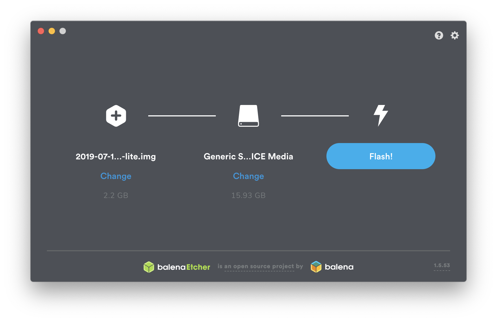
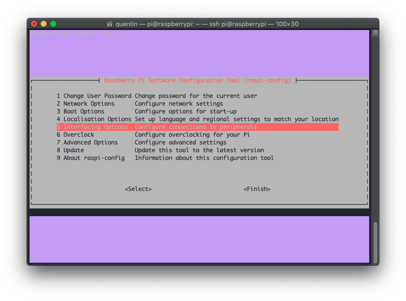
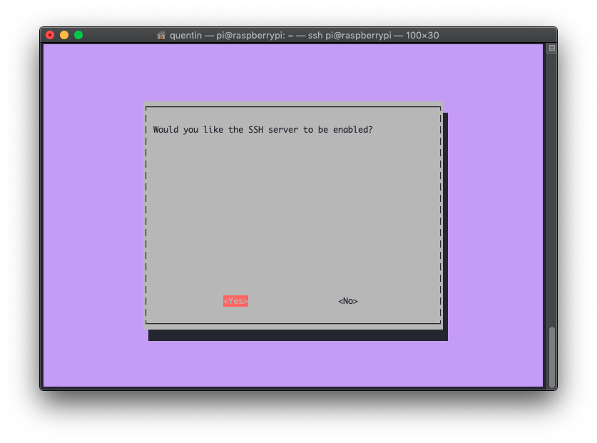
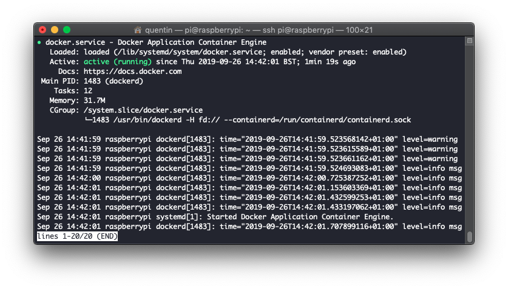

# Installer Docker & Portainer sur Raspberry

## Introduction

## Pré-requis
- [Etcher](https://www.balena.io/etcher/) : logiciel qui nous permettra de flasher proprement la carte SD bootable pour le Raspberry
- [Raspbian](https://www.raspberrypi.org/downloads/raspbian/) : l'OS de prédilection des Raspberry. La version à choisir dépend de votre besoin. Personnellement, j'utilise toujours mes Raspberry en tant que serveur, je prends donc systématiquement la version "Lite" quitte à installer manuellement des choses par la suite.
- Quelques bases en ligne de commandes
## Installation

### Flasher la carte SD & bootez
1. Insérez votre carte SD
2. Ouvrez Etcher
3. Choisissez l'image de Raspbian que vous avez téléchargé ainsi que le périphérique correspondant à votre carte SD puis cliquez sur "Flash".



4. Mettez la carte SD dans le Raspberry, brancher un câble Ethernet, l'alimentation ainsi qu'un clavier et un écran (via HDMI) qui nous seront utiles pour le premier boot.

### Activer le SSH sur le Raspberry
1. Une fois votre Raspberry démarré, loguez vous via l'utilisateur `pi` et le mot de passe par défaut : `raspberry`. **Attention, le clavier sera peut-être vu comme un QWERTY.**
2. Nous allons activer le serveur SSH du Raspberry, tapez : `sudo raspi-config` et faites la configuration suivante : Interfacing Options > SSH > Yes. Ci-après les écrans de configuration.





C'est fini ! Vous pouvez débranche clavier et écran, il ne vous serviront plus.
### Installer Docker
Dans la plupart des cas, le Raspberry va s'annoncer correctement auprès de votre routeur et prendra le nom `raspberrypi`. Vous pourrez donc facilement vous y connecter. Installons désormais Docker :
1. Depuis votre terminal préféré (via un ordinateur présent sur le même réseau) :
```
ssh pi@raspberrypi
```
2. Nous allons suivre [les instructions officielles de Docker](https://docs.docker.com/install/linux/docker-ce/debian/#install-using-the-convenience-script) et utilisé le script officiel pour installer Docker :
```
curl -fsSL https://get.docker.com -o get-docker.sh
sudo sh get-docker.sh
```
Soyez patients, le script mets un peu de temps à tout installer.
3. Une fois que vous avez récupéré la main, vous pouvez taper la commande suivante pour vérifier que Docker est bien "running" :
```
sudo systemctl status docker
```



### Installer Portainer


https://www.portainer.io/installation/
curl -L https://downloads.portainer.io/portainer-agent-stack.yml -o portainer-agent-stack.yml
sudo docker swarm init
sudo docker stack deploy --compose-file=portainer-agent-stack.yml portainer
<!--stackedit_data:
eyJoaXN0b3J5IjpbLTIwNzg0MTk1ODUsMTc2MjE2OTAwNV19
-->