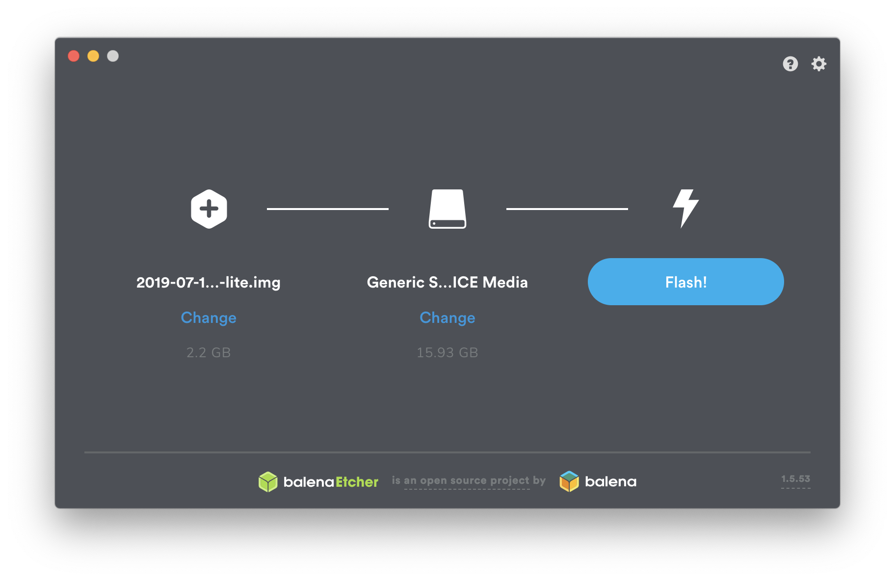
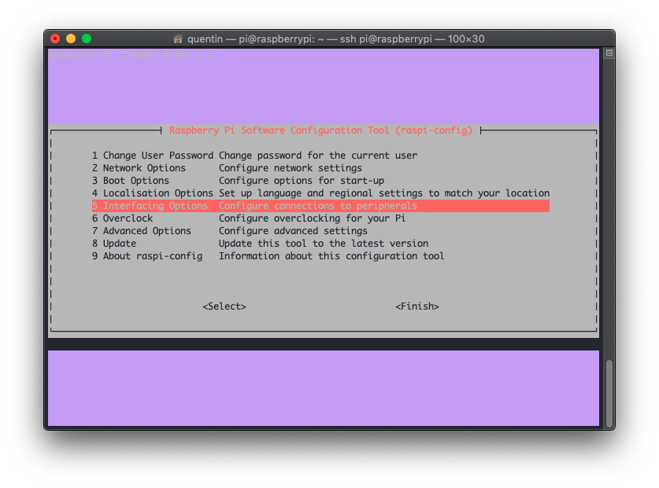
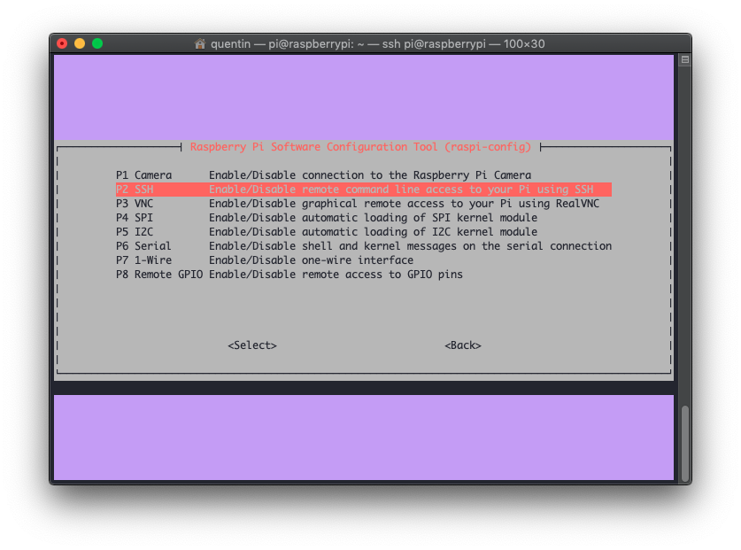
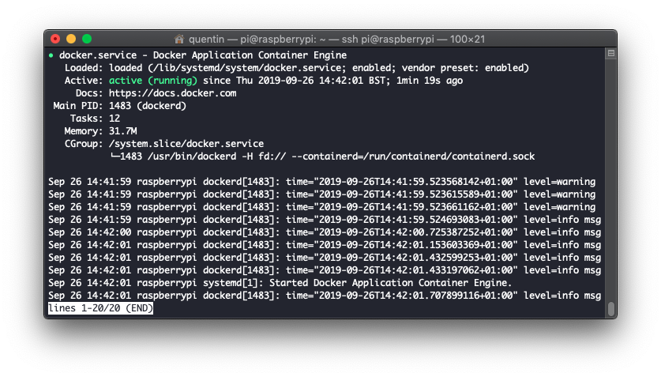
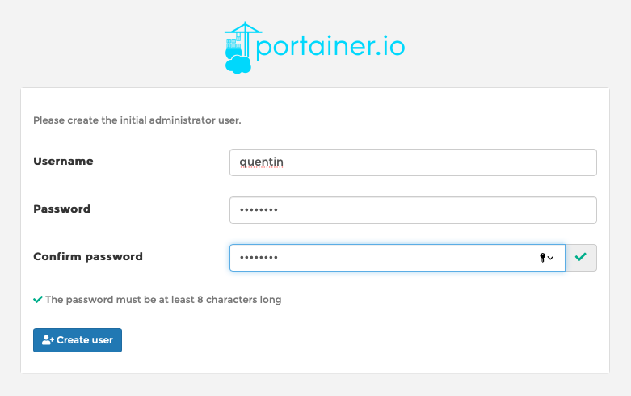
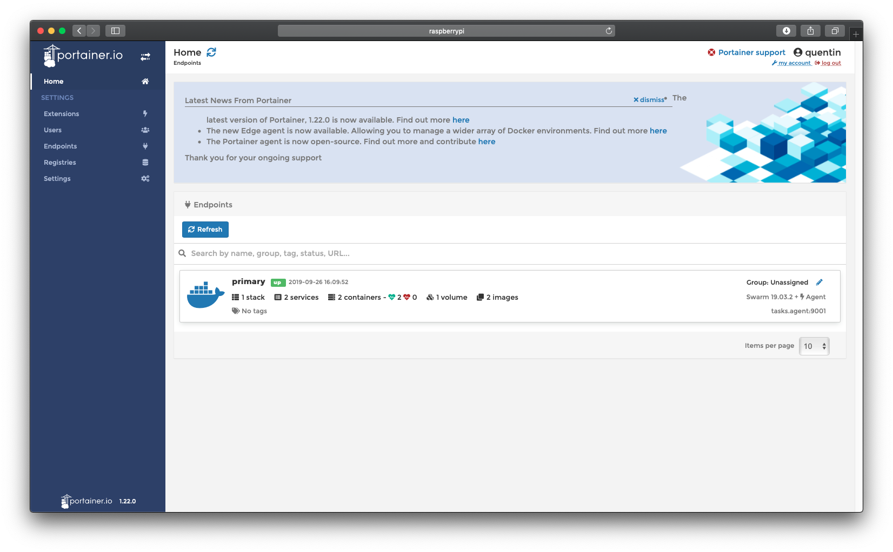

# Installer Docker & Portainer sur Raspberry

## Introduction

_Bientôt !_

## Pré-requis

* [Etcher](https://www.balena.io/etcher/) : logiciel qui nous permettra de flasher proprement la carte SD bootable pour le Raspberry
* [Raspbian](https://www.raspberrypi.org/downloads/raspbian/) : l'OS de prédilection des Raspberry. La version à choisir dépend de votre besoin. Personnellement, j'utilise toujours mes Raspberry en tant que serveur, je prends donc systématiquement la version "Lite" quitte à installer manuellement des choses par la suite.
* Quelques bases en ligne de commandes

  **Installation**

### Flasher la carte SD & bootez

1. Insérez votre carte SD
2. Ouvrez Etcher
3. Choisissez l'image de Raspbian que vous avez téléchargé ainsi que le périphérique correspondant à votre carte SD puis cliquez sur "Flash".



1. Mettez la carte SD dans le Raspberry, branchez un câble Ethernet, l'alimentation ainsi qu'un clavier et un écran \(via HDMI\) qui nous seront utiles pour le premier boot.

### Activer le SSH sur le Raspberry

1. Une fois votre Raspberry démarré, loguez vous via l'utilisateur `pi` et le mot de passe par défaut : `raspberry`. **Attention, le clavier sera peut-être vu comme un QWERTY.**
2. Nous allons activer le serveur SSH du Raspberry, tapez : `sudo raspi-config` et faites la configuration suivante : **Interfacing Options &gt; SSH &gt; Yes**. Ci-après les écrans par lesquels vous devez passer.

  

C'est fini ! Vous pouvez débrancher clavier et écran, ils ne vous serviront plus.

### Installer Docker

Dans la plupart des cas, le Raspberry va "s'annoncer" correctement auprès de votre routeur \(via son service mDNS\) et prendra le hostname `raspberrypi` sur le réseau. Vous pourrez donc facilement vous y connecter.

Installons désormais Docker : 1. Depuis votre terminal préféré \(via un ordinateur présent sur le même réseau\) :

```text
ssh pi@raspberrypi //(mot de passe : raspberry)
```

1. Nous allons suivre [les instructions de Docker](https://docs.docker.com/install/linux/docker-ce/debian/#install-using-the-convenience-script) et utiliser le script officiel pour installer Docker :

   ```text
   curl -fsSL https://get.docker.com -o get-docker.sh
   sudo sh get-docker.sh
   ```

   Soyez patients, le script met un peu de temps à tout installer.

2. Une fois que vous avez récupéré la main, vous pouvez taper la commande suivante pour vérifier que Docker est bien "running" :

   ```text
   sudo systemctl status docker
   ```



### Installer Portainer

Dernière étape, nous allons vouloir installer [Portainer](http://portainer.io) pour gérer facilement et graphiquement nos conteneurs Docker, nos services et nos stacks. 1. Initialiser Docker Swarm \(l'orchestrateur natif de Docker\), c'est lui qui vous permettra de déployer des stacks \(ensembles de conteneurs\) et par extensions des services, conteneurs, volumes, etc.

```text
    sudo docker swarm init
```

1. Télécharger le fichier de stack de Portainer :

   ```text
    curl -L https://downloads.portainer.io/portainer-agent-stack.yml -o portainer-agent-stack.yml
   ```

2. Déployer la stack :

   ```text
    sudo docker stack deploy --compose-file=portainer-agent-stack.yml portainer
   ```

3. Portainer est désormais accessible via votre navigateur à l'adresse suivante : [http://raspberrypi:9000](http://raspberrypi:9000).

Configurez le compte administrateur. **Attention, de mémoire il faut créer le compte administrateur dans les 5 premières minutes, sinon Portainer s'arrête par sécurité** :



Vous voilà rendu sur l'interface de Portainer !



Nous nous retrouverons dans un autre billet pour apprendre à l'utiliser. 

