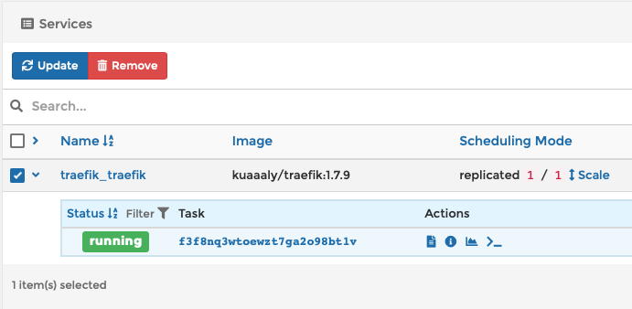
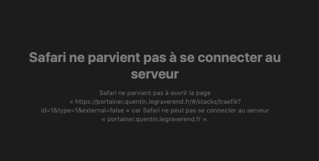
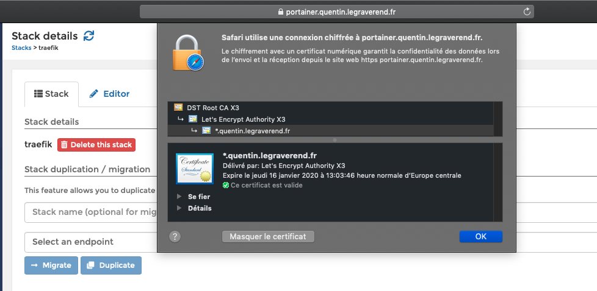

# Gestion des certificats SSL/TLS sur un domaine personnel

## Introduction

Vous l'avez peut-être remarqué, j'ai un [site vitrine personnel](https://quentin.legraverend.fr) hébergé chez OVH. La partie DNS est quant à elle gérée par le service Route 53 d'AWS, et sur le niveau encore au-dessus, "mes domaines" \(`quentin.legraverend.fr` + `*.quentin.legraverend.fr`\), sur lesquels j'ai la main sont une simple délégation depuis le domaine racine \(`legraverend.fr`\). Bref, tout ceci pour dire que je m'occupe moi même de la gestion de ce site, de développement, de son hébergement et de sa sécurisation. Je parlerai ici de la partie HTTPS via SSL/TLS seulement !

## Outils utilisés

* [Let's Encrypt](https://letsencrypt.org/fr/) : pour avoir des certificats approuvés par les navigateurs et gratuits.
* [Lego](https://github.com/go-acme/lego) : pour générer ces mêmes certificats.
* [Traefik](https://traefik.io) : reverse proxy / load balancer pour orientez les requêtes lorsque vous vous rendez sur un de mes domaines.
* [Docker](https://www.docker.com) : qui est le socle pour faire tourner le reste.
* [Portainer](https://www.portainer.io) : qui permet d'interagir avec Docker via une interface de gestion / administration dédiée.

## Gérer & déployer les certificats SSL/TLS

Normalement, la liste des outils ci-dessus se suffit à elle-même étant donné qu'ils sont tous très bien documenté. Mais étant donné que je me fais une petite documentation perso qui me sert de base dès que j'ai besoin de renouveler manuellement des certificats ou de mettre en place ce même process ailleurs, je vais en profiter pour étoffer un tout petit peu et rendre ceci utile à d'autres.

### Accès nécessaires pour le challenge DNS

Tout ceci est [bien documenté](https://github.com/go-acme/lego#dns-providers) côté Lego. C'est du cas par cas \(en fonction de votre provider DNS\). En ce qui me concerne, pour Route 53, il suffit d'ajouter un utilisateur dans IAM avec la `Policy` suivante :

```javascript
{
    "Version": "2012-10-17",
    "Statement": [
        {
            "Sid": "",
            "Effect": "Allow",
            "Action": [
                "route53:GetChange",
                "route53:ChangeResourceRecordSets",
                "route53:ListResourceRecordSets"
            ],
            "Resource": [
                "arn:aws:route53:::hostedzone/*",
                "arn:aws:route53:::change/*"
            ]
        },
        {
            "Sid": "",
            "Effect": "Allow",
            "Action": "route53:ListHostedZonesByName",
            "Resource": "*"
        }
    ]
}
```

Quand vous créez votre utilisateur, vous récupérez ses credentials. Credentials que vous pourrez renseigner de plusieurs manières sur la machine qui va vous servir à générer le certificat, soit dans `~/.aws/credentials` + `~/.aws/config` \(le second pour la partie, region & hosted zone\), soit comme j'ai pris l'habitude de le faire, en déclarant des variable directement via le terminal ou bien le script qui va générer vos certificats.

### Générer ou renouveler les certificats

En parlant de script, voici le mien `run|renew.sh`, en fonction de l'opération que vous souhaitez effectuer `run` ou `renew`, adaptez l'appel à `./lego` :

```bash
#!/bin/bash
AWS_ACCESS_KEY_ID=XXX \
AWS_HOSTED_ZONE_ID=XXX \
AWS_REGION=XXX \
AWS_SECRET_ACCESS_KEY=XXX \
./lego --email="quentin@legraverend.fr" \
    --domains="*.quentin.legraverend.fr" \
    --domains="quentin.legraverend.fr" \
    --dns="route53" run|renew
```

Il faut bien évidement changer les `XXX` en conséquence. Une fois ceci fait il n'y a plus qu'à exécuter le script `./run.sh` et patienter pendant que les challenges s'exécutent et que les serveurs de Let's Encrypt vous communiquent les certificats signés. Ceux-ci se retrouveront dans le dossier `.lego` du répertoire depuis lequel vous exécutez le script \(donc logiquement : le répertoire où vous avez cloné lego\) :

```text
**/opt/lego/.lego/certificates**# ls -l    
total 16
-rw------- 1 root root 3616 Oct 18 15:03 _.quentin.legraverend.fr.crt
-rw------- 1 root root 1648 Oct 18 15:03 _.quentin.legraverend.fr.issuer.crt
-rw------- 1 root root  245 Oct 18 15:03 _.quentin.legraverend.fr.json
-rw------- 1 root root 1675 Oct 18 15:03 _.quentin.legraverend.fr.key
```

### Builder une nouvelle image Docker pour Traefik

J'utilise Traefik pour la partie reverse proxy et load balancer de mes sites web. Traefik est donc responsable de la gestion des certificats SSL/TLS pour interagir avec les navigateurs des clients. Tout ceci fonctionnant dans Docker, il va falloir builder une nouvelle image pour Traefik. Il y a d'autres manière de faire \(dont certaines plus flexibles\), mais personnellement, je n'aime par exemple pas faire des points de montage dans une image vers mes certificats. J'ai donc fait le choix de builder une nouvelle image à chaque renouvellement de certificat et d'utiliser l'instruction `COPY` du `Dockerfile` pour copier les certificats dans cette dernière.

Voici mon `Dockerfile` :

```text
FROM traefik:1.7.9
COPY quentin.legraverend.fr.crt /etc/ssl/certs/quentin.legraverend.fr.crt
COPY quentin.legraverend.fr.key /etc/ssl/certs/quentin.legraverend.fr.key
COPY traefik.toml /etc/traefik/traefik.toml
```

Et voici le script `build.sh` qui lance le build de l'image Docker :

```bash
#!/bin/bash
cp /opt/lego/.lego/certificates/_.quentin.legraverend.fr.crt quentin.legraverend.fr.crt
cp /opt/lego/.lego/certificates/_.quentin.legraverend.fr.key quentin.legraverend.fr.key
docker build -t kuaaaly/traefik:1.7.9 .
rm quentin.legraverend.fr.crt
rm quentin.legraverend.fr.key
```

> **Attention** : Prudence extrême concernant l'image Docker de Traefik que nous venons de builder et dans laquelle nous embarquons les certificats, elle doit absolument rester privée et dans un monde parfait, elle ne devrait jamais sortir de cette machine précise

Le plus dur du travail est fait !

### Déployer la nouvelle image

Le moment fun du guide arrive ! Car jusqu'ici, nous n'avons touché à rien de l'existant visible par les utilisateurs finaux. Mais là, nous arrivons dans une situation type "le serpent qui se mord la queue" et nous avons la possibilité de scier la branche sur laquelle nous sommes assis. Explication :

* Notre nouvelle image de Traefik est prête
* Actuellement Traefik tourne sur base de son ancienne image
* Nous accédons à Portainer via l'intermédiaire de... Traefik !

Vous me voyez venir... Nous allons faire la mise à jour de l'image de Traefik avec un outil lui-même servi par Traefik.

Bon, trêve de bavardage, rendons-nous sur Traefik, dans la section `Stack` ou `Services`, on sélectionne Traefik en le cochant puis on clique sur `Update` !



La page devrait recharger une première fois sans soucis \(car Traefik n'est pas encore coupé\), puis quelques secondes plus tard, si vous actualisez, vous devriez voir quelque chose dans ce goût là :



Si vous avez tout bien fait, patientez une petite minute en plus et vous devriez récupérer la main sur Portainer :



Et voilà ! Vous pouvez vérifier avec le navigateur que le certificat à bien été renouvelé. Let's Encrypt fournit des certificats valides 3 mois. 

